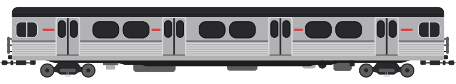

{:.trainimg}

[M-Series](https://en.wikipedia.org/wiki/M_series_(Toronto_subway))

{:.trainimg}

[G-Series](https://en.wikipedia.org/wiki/G_series_(Toronto_subway))

### About

The Bloor-Danforth Subway (Now known as Line 2) opened on Febuary 26, 1966 — just three years after the last subway expansion.

For the first six months both the Yonge-University & Bloor-Danforth lines operated as one with trains starting from Eglinton and running around the loop and then either to Keele or Woodbine station.  This was deemed ridiculous and got scrapped in favour of the two line system still in use today.