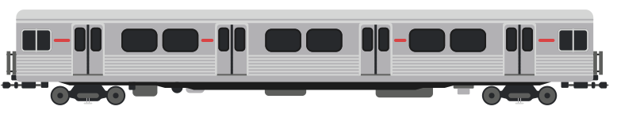

{:.trainimg}

[H-Series](https://en.wikipedia.org/wiki/H_series_(Toronto_subway))

{:.trainimg}

[M-Series](https://en.wikipedia.org/wiki/M_series_(Toronto_subway))

{:.trainimg}

[G-Series](https://en.wikipedia.org/wiki/G_series_(Toronto_subway))

### About

1978 marked the opening of the Spadina Line, a portion of the already existing Yonge-University line.  If you wanted to know why this was referred to as the Yonge-University-Spadina line until the TTC switched to a numbered system well, that's why.