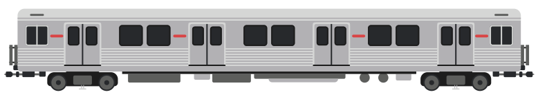
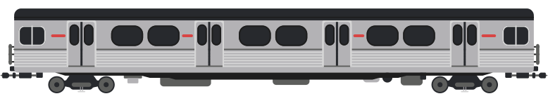

{:.trainimg}

[T-Series](https://en.wikipedia.org/wiki/T_series_(Toronto_subway))

{:.trainimg}

[H-Series](https://en.wikipedia.org/wiki/H_series_(Toronto_subway))

{:.trainimg}

[M-Series](https://en.wikipedia.org/wiki/M_series_(Toronto_subway))

### About

In 1996 Line 1 was given a one stop extension to Downsview Station (now renamed to Shepard West).  The last of the G-Series cars were retired in 1990 with the new T-Series cars starting in 1995.