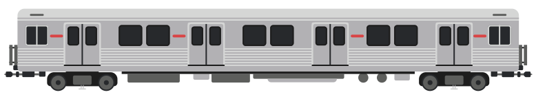

{:.trainimg}

[T-Series](https://en.wikipedia.org/wiki/T_series_(Toronto_subway))

{:.trainimg}

[S-Series](https://en.wikipedia.org/wiki/S_series_(Toronto_subway))

{:.trainimg}

[H-Series](https://en.wikipedia.org/wiki/H_series_(Toronto_subway))

2002 saw the completion of the most recent new transit line, the Sheppard Subway.  While possibly built with good intentions the subway line does not extend far enough to reach larger amounts of people.