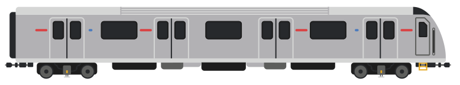

{:.trainimg}

[Toronto Rocket](https://en.wikipedia.org/wiki/Toronto_Rocket)

{:.trainimg}

[T-Series](https://en.wikipedia.org/wiki/T_series_(Toronto_subway))

### About

2017 saw the opening of the Spadina extension and the renaming of Downsview station to Shepard West.  Line 1 was extended from the previous ending point at the former Downsview station up to Vaughan Metropolitan Centre, the first TTC station outside of the boundaries of Toronto.

The new Toronto Rocket trains were first introduced in 2014 and they fully populate Line 1 & 4.  Line 2 still uses the T-Series cars which are set to be replaced some time in the early 2030s.

The Eglinton LRT is in the middle of construction at this point and is set to open in September 2021